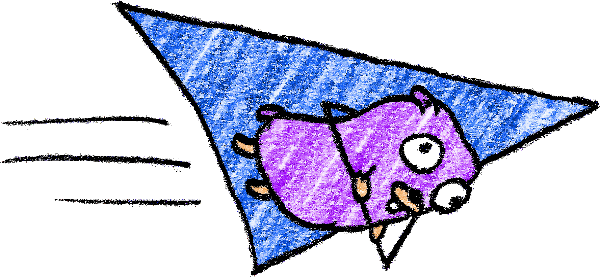
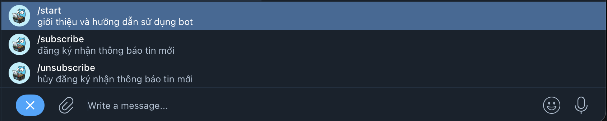
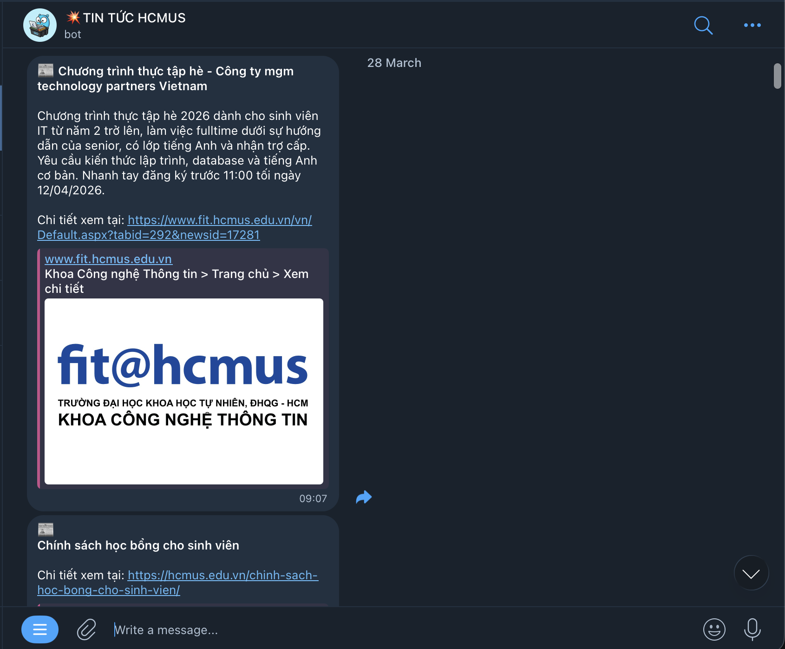
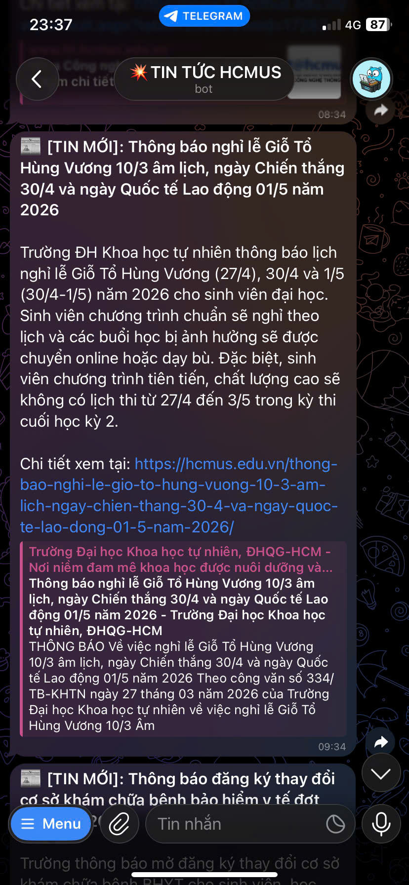
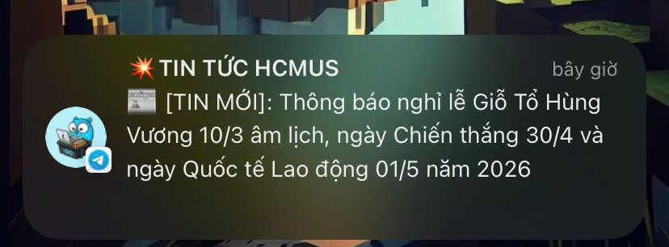

<h2 align="center"><samp>🐳 HCMUS News Telegram Bot 🐳</samp></h2>

<p align="center">
  
</p>

<p align="center">
<a href="https://git.io/typing-svg"></a>
</p>

<p align="center">
<a href="https://t.me/hcmus_tintuc_bot"></a>&nbsp;
&nbsp;
&nbsp;

</p>

## <samp> what </samp>

> tinh nang thong bao tin moi cua [bot discord](https://github.com/cuogne/discord-bot/blob/master/commands/fit-hcmus-news/INSTRUCTION.md) duoc tach ra mot phien ban cho telegram va nang cap hon.

## <samp> 0. How to use </samp>

<details>
<summary><samp> click here (for users) </samp></summary>

- Cài đặt app Telegram trên [PC/Laptop](https://desktop.telegram.org/) | [Android](https://play.google.com/store/apps/details?id=org.telegram.messenger&hl=vi) | [iOS](https://apps.apple.com/vn/app/telegram-messenger/id686449807?l=vi)

- Click vào link và start bot: [https://t.me/hcmus_tintuc_bot](https://t.me/hcmus_tintuc_bot)

</details>

## <samp> 1. Advanced features </samp>

- Bot crawl tin tức của HCMUS và gửi thông báo đến user thông qua Telegram.
- New feature: Tóm tắt nội dung chính của bài viết bằng Gemini, giúp nắm nhanh thông tin trước khi đọc tiếp.
- Quét tin tức mới 10 phút/lần, gửi ngay tới user khi có tin mới.
- Tập trung vào 1 feature chính là thông báo tin mới (không tích hợp quá nhiều tính năng như bot discord).
- Sử dụng goroutines, channel và worker pool của Go để xử lý đồng thời, tăng hiệu suất.

> Lưu ý: Bot chỉ hỗ trợ private chat (chat riêng/cá nhân), không hỗ trợ group chat.

## <samp> 2. News Sources </samp>

| Category                     | URL                                                                        |
| ---------------------------- | -------------------------------------------------------------------------- |
| Thông tin dành cho sinh viên | https://hcmus.edu.vn/category/dao-tao/dai-hoc/thong-tin-danh-cho-sinh-vien |
| Lịch thi - Phòng khảo thí    | https://ktdbcl.hcmus.edu.vn/index.php/cong-tac-kh-o-thi/l-ch-thi-h-c-ky    |
| Thông báo - Phòng khảo thí   | https://ktdbcl.hcmus.edu.vn/index.php/thong-bao                            |
| Khoa CNTT - FIT@HCMUS        | https://www.fit.hcmus.edu.vn/tin-tuc                                       |

<details>
<summary><samp>ảnh meme của Gopher: </samp></summary>
  
<br />
  
> source image: [https://github.com/nlepage/gophers](https://github.com/nlepage/gophers)

</details>

## <samp> 3. Telegram commands </samp>

<table>
  <tr>
    <td valign="top" width="75%">
      <p><b>Command</b></p>
      <p>
        <code>/start</code> - Giới thiệu và hướng dẫn sử dụng bot<br />
        <code>/subscribe</code> - Đăng ký nhận thông báo<br />
        <code>/unsubscribe</code> - Hủy nhận thông báo
      </p>
      
    </td>
    <td align="right" valign="top" width="25%">
      
    </td>
  </tr>
</table>

<details>
<summary><samp>Factos 1:</samp></summary>

> <i>maybe toi se xoa tinh nang nay ben bot discord va chi phat trien them ben nay (neu co thoi gian) (🐳)</i>

</details>

## <samp> 4. Demo </samp>

<details>
<summary><samp>Click here to see demo</samp></summary>

<br />

<table align="center">
  <thead>
    <tr>
      <th>PC/Laptop</th>
      <th>Mobile</th>
    </tr>
  </thead>
  <tbody>
    <tr>
      <td align="center"></td>
      <td align="center"></td>
    </tr>
  </tbody>
</table>

<table align="center">
  <thead>
    <tr>
      <th>Thông báo</th>
    </tr>
  </thead>
  <tbody>
    <tr>
      <td align="center"></td>
    </tr>
  </tbody>
</table>

</details>

## <samp> 5. Tech stack </samp>

- **Language**: [Go 1.26.1](https://go.dev/doc/go1.26)
- **Database**: [Supabase](https://supabase.com/) (PostgreSQL), [pgx/v5](https://github.com/jackc/pgx)
- **Crawler**: [Colly](https://github.com/gocolly/colly) (HTML), [gofeed](https://github.com/gorhill/gofeed) (RSS)
- **Content extractor**: [go-readability](https://github.com/go-shiori/go-readability)
- **AI Summarization**: [Gemini](https://github.com/google/generative-ai-go)
- **Telegram Bot**: [Telebot v4](https://github.com/tucnak/telebot)
- **Scheduler**: [robfig/cron](https://github.com/robfig/cron)
- **Concurrency**: Goroutines, Channels, sync.WaitGroup, Worker Pool
- **Deployment**: Docker + CI/CD pipeline (GitHub Actions)

<details>
<summary><samp>Factos 2:</samp></summary>

> <i>t thay code bang golang suong hon js (i'm addicted to golang lol xD)</i>

</details>

## <samp> 6. Run (for dev) </samp>

<details>
<summary><samp> click here (if u want to run it locally)</samp></summary>

<br />

B1. Đảm bảo đã cài Go 1.26.1 thông qua: [https://go.dev/doc/install](https://go.dev/doc/install)

```zsh
brew install go # for homebrew (macOS)

go version # check version
```

B2. Clone repo này về và di chuyển vào thư mục:

```zsh
git clone https://github.com/cuogne/NewsTeleBot.git

cd NewsTeleBot
```

B3. chạy file [setup.sh](setup.sh) đã được thiết lập sẳn trong repo để setup:

```bash
bash setup.sh
```

> shell trên giúp bạn cài đặt các dependency cần thiết của Go, tạo file `.env` dựa theo mẫu [.env.example](.env.example) và thiết lập hot reload.

B4. Sau khi chạy xong, bạn sẽ có file `.env` trong thư mục với các biến môi trường cần thiết.

```env
TELEGRAM_BOT_TOKEN=your_telegram_bot_token
SUPABASE_URL=your_supabase_url
GEMINI_API_KEY=your_gemini_api_key
```

Thay các token trong file `.env` vừa được tạo bằng token của bạn, cách lấy như sau:

- **Telegram Bot Token**: Cài đặt Telegram (link có ở trên), tạo bot trên Telegram bằng cách nhắn tin với [BotFather](https://t.me/BotFather), gõ `/newbot` và làm theo hướng dẫn.

- **Supabase URL**: Login và tạo project trên [Supabase](https://supabase.com/), dán script tạo database trong [db/database.sql](db/database.sql) vào `SQL Editor` và run nó, sau đó chọn `Connect` và lấy URL trong `Session pooler`.

- **Gemini API Key**: tạo tài khoản trên [Google AI Studio](https://aistudio.google.com/), chọn `Get API Key` và lấy key.

B5. Run bot:

```zsh
go run ./cmd/bot # chạy trực tiếp

make run # chạy bằng Makefile, lệnh như chạy trực tiếp

make dev # chạy ở chế độ dev, có hot reload (sử dụng air)

go build -o ./bin/bot ./cmd/bot # build thành binary
```

Hoặc run thông qua docker:

```zsh
docker build -t hcmus-news-tele-bot .
docker run -d --env-file .env --name my-tele-bot hcmus-news-tele-bot
```

-----------

### Lưu ý khi mở rộng feeds mới:

Nếu bạn muốn phát triển thêm nhiều feeds mới tuân theo cấu trúc hiện có, vui lòng đảm bảo:

B1. Tạo feeds mới trong [resource.go](config/resource.go) với cấu trúc của type `Resource` và thêm vào slice `Feeds`:

```go
// resource.go
type Resource struct {
	URL      string
	Name     string
	Category string
	Format   string
}

// thêm feeds mới ở đây
var Feeds = []Resource{
  // ...
  {
    URL:      "https://example.com/new-feed",
    Name:     "the name of your feed",
    Category: "the category of your feed (must match with table name in database.sql)",
    Format:   "the format of your feed (must match with case in crawl.go)",
  },
}
```

B2. Tạo table mới trong [database.sql](db/database.sql) theo cấu trúc schema đã có:

```sql
-- database.sql
create table <name_of_table_is_equal_to_category> (
  url text primary key,
  title text not null,
  send_at timestamp,
  prompt_token int,
  completion_token int
);
```

B3. Tên Category trong [resource.go](config/resource.go) phải trùng với tên table trong [database.sql](db/database.sql). Ví dụ: nếu bạn tạo feeds có category = "tinmoi", bạn phải tạo table "tinmoi" trong db/database.sql.

- Vì thiết lập tên table trong db = category trong feeds để dễ quản lý và tránh lỗi khi thêm feeds mới. Nếu không khớp, bot sẽ không select và insert được dữ liệu.

> Hoặc bạn sẽ phải sửa code trong repository hoặc service để khớp với lựa chọn của bạn =))

B4. Ngoài ra, bạn phải viết thêm file crawler cho feeds mới của bạn trong thư mục [crawler](internal/crawler) (vì web bạn thêm vào sẽ có cấu trúc html không khớp với script hiện tại) và thêm nó vào case trong file [crawl.go](internal/crawler/crawl.go). 

Và case format trong [crawl.go](internal/crawler/crawl.go) phải khớp với `Format` trong [resource.go](config/resource.go) của bạn.

```go
// crawl.go
// ...
case "your_format": // your_format = config.Feeds[idx].Format
  listArticles, err := your_crawl_function(feed.URL, feed.Category)

  ch <- model.ListArticles{
    Articles: listArticles,
    Category: feed.Category,
    Err:      err,
  }
```

</details>

<p align="center">
  
</p>
